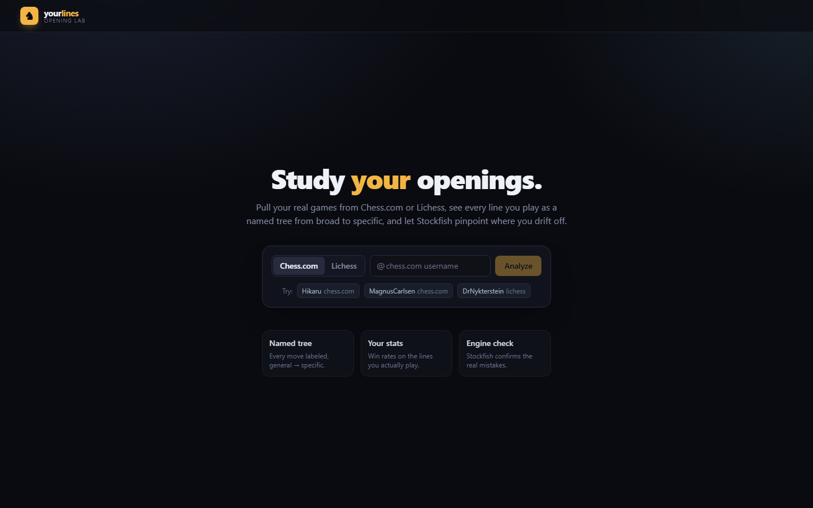

# yourlines — chess suite

Study **your** chess openings. Pull your real games from Chess.com or Lichess,
see every line you play as a named tree from broad to specific, and let Stockfish
pinpoint where you drift off.

yourlines is also the hub of a **chess suite** served from one origin:

| URL        | App                                                       |
| ---------- | --------------------------------------------------------- |
| `/`        | **Lines** — this app (opening explorer + weak spots)      |
| `/play/`   | **Play** — Chess Interface (analysis board, play vs SF)   |
| `/gym/`    | **Gym** — ChessGym (opening line drills)                  |
| `/review/` | **Review** — Chess Reviewer (game review, move classify)  |

The three sub-apps live in their own repos and are snapshotted in with
`npm run sync-apps` (see `scripts/sync-apps.mjs` — it copies from the sibling
folders `../stockfish`, `../ChessGym`, `../ChessMoveReviewer` and injects the
floating suite switcher `public/suite/nav.js` into each). After changing a
sub-app, run the sync and commit here. One origin means all apps can share
browser storage — the basis for coming cross-app features (shared profiles,
"review this game", "train this line").



## What it does

- **Import** — fetches *all* your games straight from the Chess.com and Lichess
  public APIs (no login, no keys). Games are cached in **IndexedDB**, so a reload
  restores instantly with no re-fetch, and **Refresh** pulls only games newer than
  your last import. Runs entirely in the browser.
- **Multiple accounts** — import as many accounts as you like; each is cached
  separately and you switch between them instantly. **Export / Import** produces a
  single JSON backup (also the future cloud-sync payload) for moving data between
  browsers or devices.
- **Named lines tree** — aggregates your games into an opening tree. Every move is
  labelled with its ECO opening name, refined from general → specific as you go
  deeper (e.g. _Sicilian Defense › Najdorf Variation › English Attack_).
- **Your openings** — the opening families you play most, ranked by frequency with
  your win/draw/loss record and score.
- **Weak spots** — decision points you reach often but score poorly from, flagged
  statistically, then confirmed on demand with **Stockfish** running in-browser.

Separate White and Black repertoires; toggle between them.

## Run it

**Windows:** double-click **`yourlines.bat`** — it checks Node, installs deps on
first run, stops any previous instance still on port 5173, then starts the app
and opens your browser.

**Any platform:**

```bash
npm install
npm run dev      # http://localhost:5173
```

Try it with `Hikaru` / `MagnusCarlsen` (Chess.com) or `DrNykterstein` (Lichess).

```bash
npm run build    # typecheck + production bundle
```

> Open the served URL (`http://localhost:5173`) — opening `index.html` as a file
> gives a blank page, since the app must be served.

## Alpha debug logging

While `ALPHA` is `true` (see `src/lib/debug.ts`), the app captures uncaught
errors, unhandled rejections, failed imports, and engine problems into a capped,
`localStorage`-persisted log. A **🐞 alpha** badge (bottom-right) opens a panel to
view / copy / download / clear entries, or grab them from the console via
`window.yourlines.export()`. Set `ALPHA = false` to ship without it.

## How it's built

| Area            | Choice                                                              |
| --------------- | ------------------------------------------------------------------ |
| App             | React 19 + TypeScript + Vite                                       |
| Styling         | Tailwind v4                                                        |
| Chess logic     | [chess.js](https://github.com/jhlywa/chess.js)                    |
| Board           | [react-chessboard](https://github.com/Clariity/react-chessboard) |
| State           | Zustand                                                            |
| Opening names   | [Lichess chess-openings](https://github.com/lichess-org/chess-openings) dataset, baked into `src/data/openings.json` |
| Engine          | Single-threaded Stockfish 10 WASM (`public/engine/`)               |

### Why single-threaded Stockfish

The multi-threaded builds need `SharedArrayBuffer`, which requires the
`COOP`/`COEP` isolation headers — and those headers would break the cross-origin
`fetch`es to the Chess.com / Lichess APIs. The single-threaded HCE build is
self-contained (no NNUE net file), runs in a plain Web Worker, and is more than
strong enough to judge opening positions.

## Project layout

```
src/
  lib/
    openings.ts     position (EPD) → ECO name lookup + name segmentation
    chessApi.ts     Chess.com + Lichess import → normalised Game[]
    tree.ts         move-tree aggregation, opening summary, weakness detection
    engine.ts       promise-based Stockfish worker wrapper
    chessUtil.ts    UCI → SAN helpers
  hooks/
    useEval.ts      analyse a FEN while enabled
    EvalContext.tsx share one analysis across the board + panels
  components/       Board, LinePanel, OpeningTree, CommonOpenings, Weaknesses, …
  store/useStore.ts app state (games, repertoires, navigation)
  data/openings.json  generated — do not edit by hand
scripts/
  build-openings.mjs  regenerate openings.json from the ECO TSVs
  verify.mjs          smoke-test the pipeline against a live account
  shot.mjs            Playwright screenshot walkthrough
```

### Regenerating the opening names

```bash
node scripts/build-openings.mjs   # reads scripts/{a..e}.tsv → src/data/openings.json
```
