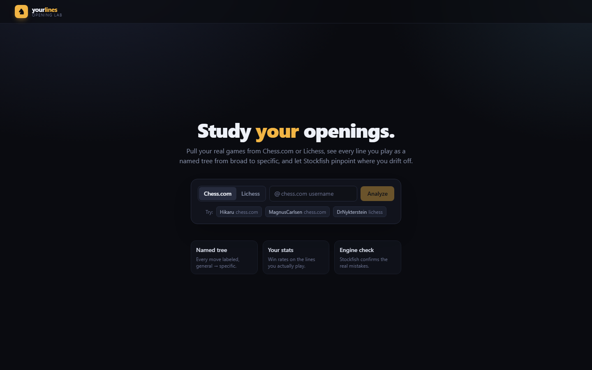

# yourlines — chess suite

Study **your** chess openings. Pull your real games from Chess.com or Lichess,
see every line you play as a named tree from broad to specific, and let Stockfish
pinpoint where you drift off.

yourlines is also the hub of a **chess suite** served from one origin:

| URL         | App                                                        |
| ----------- | ---------------------------------------------------------- |
| `/`         | **Lines** — this app (opening explorer + weak spots)       |
| `/play/`    | **Play** — Chess Interface (analysis board, play vs SF)    |
| `/spar/`    | **Spar** — Sparring Coach (play on against a human-like opponent) |
| `/gym/`     | **Gym** — ChessGym (opening line drills)                   |
| `/review/`  | **Review** — Chess Reviewer (game review, move classify)   |
| `/puzzles/` | **Puzzles** — Your Chess Puzzles (built from your own losses) |

Each sub-app lives in its own repo and is snapshotted in with
`npm run sync-apps` (see `scripts/sync-apps.mjs`, which reads the registry in
`scripts/suite-apps.mjs` — one entry per app, naming the sibling folder it
comes from — and injects the shared suite bar `public/suite/nav.js` into
each). After changing a sub-app, run the sync and commit here, or use
that app's own `deploy.bat`, which does the whole thing in one step. One
origin means all apps can share browser storage — the basis for the cross-app
features (shared profiles, "review this game", "train this line").

### Carrying the board between apps

One bar, carried by all six: a strip across the top of the window naming
every app, with the current one lit. `public/suite/nav.js` builds it, the
sync injects it into each sub-app, and the hub loads it directly from its own
`index.html` — so there is one implementation and one place to add a seventh
app.

It does more than link: it hands the position you are looking at to whichever
app you jump to. **Play** opens it on the analysis board, **Spar** picks the
game up and plays on from it with you on the side to move, **Lines** shows how
your own games handled it, and **Gym** looks for trainer lines that match. An
app joins in by exposing `window.SuiteBoardContext()`, returning `{pgn}`
and/or `{fen}`.

The bar also gives every app the same full-screen button, and takes itself off
the screen while that is on — Esc brings both back.

It is pinned to the window rather than laid out in the page, and the room it
takes is handed back as padding on `<html>`. Putting it in the flow means
putting it inside the app's own `<body>`, and not every app has one that will
take it: the Chess Interface centres a flex row, where an in-flow bar became a
column beside the board and pushed it off the side of the window. `<html>` is
out of reach of whatever the body is doing. Where six labels will not fit
across the window the labels go and the icons stay, so every app stays one tap
from every other at any width.



## What it does

- **Import** — fetches *all* your games straight from the Chess.com and Lichess
  public APIs (no login, no keys). Games are cached in **IndexedDB**, so a reload
  restores instantly with no re-fetch, and **Refresh** pulls only games newer than
  your last import. Runs entirely in the browser.
- **Multiple accounts** — import as many accounts as you like; each is cached
  separately and you switch between them instantly. **Export / Import** produces a
  single JSON backup (also the future cloud-sync payload) for moving data between
  browsers or devices.
- **Named lines tree** — aggregates your games into an opening tree. Every move is
  labelled with its ECO opening name, refined from general → specific as you go
  deeper (e.g. _Sicilian Defense › Najdorf Variation › English Attack_).
- **Your openings** — the opening families you play most, ranked by frequency with
  your win/draw/loss record and score.
- **Weak spots** — decision points you reach often but score poorly from, flagged
  statistically, then confirmed on demand with **Stockfish** running in-browser.

Separate White and Black repertoires; toggle between them.

## Run it

**Windows:** double-click **`yourlines.bat`** — it checks Node, installs deps on
first run, stops any previous instance still on port 5173, then starts the app
and opens your browser.

**Any platform:**

```bash
npm install
npm run dev      # http://localhost:5173
```

Try it with `Hikaru` / `MagnusCarlsen` (Chess.com) or `DrNykterstein` (Lichess).

```bash
npm run build    # typecheck + production bundle
```

> Open the served URL (`http://localhost:5173`) — opening `index.html` as a file
> gives a blank page, since the app must be served.

## Alpha debug logging

While `ALPHA` is `true` (see `src/lib/debug.ts`), the app captures uncaught
errors, unhandled rejections, failed imports, and engine problems into a capped,
`localStorage`-persisted log. A **🐞 alpha** badge (bottom-right) opens a panel to
view / copy / download / clear entries, or grab them from the console via
`window.yourlines.export()`. Set `ALPHA = false` to ship without it.

## How it's built

| Area            | Choice                                                              |
| --------------- | ------------------------------------------------------------------ |
| App             | React 19 + TypeScript + Vite                                       |
| Styling         | Tailwind v4                                                        |
| Chess logic     | [chess.js](https://github.com/jhlywa/chess.js)                    |
| Board           | [react-chessboard](https://github.com/Clariity/react-chessboard) |
| State           | Zustand                                                            |
| Opening names   | [Lichess chess-openings](https://github.com/lichess-org/chess-openings) dataset, baked into `src/data/openings.json` |
| Engine          | Single-threaded Stockfish 10 WASM (`public/engine/`)               |

### Why single-threaded Stockfish

The multi-threaded builds need `SharedArrayBuffer`, which requires the
`COOP`/`COEP` isolation headers — and those headers would break the cross-origin
`fetch`es to the Chess.com / Lichess APIs. The single-threaded HCE build is
self-contained (no NNUE net file), runs in a plain Web Worker, and is more than
strong enough to judge opening positions.

## Project layout

```
src/
  lib/
    openings.ts     position (EPD) → ECO name lookup + name segmentation
    chessApi.ts     Chess.com + Lichess import → normalised Game[]
    tree.ts         move-tree aggregation, opening summary, weakness detection
    engine.ts       promise-based Stockfish worker wrapper
    chessUtil.ts    UCI → SAN helpers
  hooks/
    useEval.ts      analyse a FEN while enabled
    EvalContext.tsx share one analysis across the board + panels
  components/       Board, LinePanel, OpeningTree, CommonOpenings, Weaknesses, …
  store/useStore.ts app state (games, repertoires, navigation)
  data/openings.json  generated — do not edit by hand
scripts/
  build-openings.mjs  regenerate openings.json from the ECO TSVs
  verify.mjs          smoke-test the pipeline against a live account
  shot.mjs            Playwright screenshot walkthrough
```

### Regenerating the opening names

```bash
node scripts/build-openings.mjs   # reads scripts/{a..e}.tsv → src/data/openings.json
```
